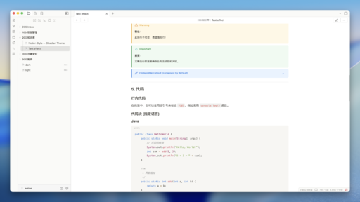
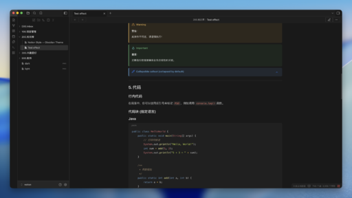

# Notion Style — Obsidian Theme

A full Notion visual overhaul for Obsidian. Every part of the interface — typography, sidebar, code blocks, callouts, tables, and interactive elements — is redesigned to match Notion's clean, minimal aesthetic. Supports light and dark mode, and is optimized for both desktop and mobile.

---

## Screenshots

light theme:




dark theme:




## Features

### Typography

- **Font stack** — matches Notion exactly: `ui-sans-serif`, `-apple-system`, `BlinkMacSystemFont`, `Segoe UI`, `Helvetica`, `Arial`
- **Heading scale** — six levels with a clear size gradient (H1 `1.875em` → H6 `0.875em`), bold weights, and tight letter-spacing on H1/H2
- **Body text** — 16px base, 1.6 line-height, optimized with `-webkit-font-smoothing: antialiased`
- **Inline code** — soft gray background with red text (`#eb5757` light / `#ff7b72` dark), compact border radius
- **Monospace font** — `SFMono-Regular`, Menlo, Consolas fallback stack

### Page Layout

- **Content width** — 1080px (wider than the default Obsidian reading line)
- **Page padding** — 96px horizontal on desktop, automatically collapses on smaller screens
- **Editor and reading view are in sync** — live-preview headings match reading-view headings pixel-for-pixel

### Sidebar & File Tree

- Notion-style file tree with generous row height (30px min) and subtle hover/active states
- Page icon (📄) prefix on file items
- Original Obsidian collapse chevron retained for folders

### Code Blocks

- **Syntax highlighting** — GitHub Light palette in light mode, GitHub Dark palette in dark mode (same as Notion)
- Languages with full token coloring: keywords, strings, functions, properties, operators, comments, tags, punctuation
- Block background uses a soft warm gray (`rgba(135, 131, 120, 0.07)`) in light mode and `#232829` in dark mode
- Language label displayed in the top-right corner of each block
- Copy button on hover

### Callouts

Five color families with colored left border, tinted background, and styled title:

| Family | Keywords | Color |
|:------:|----------|-------|
| Info | `info`, `note` | Blue |
| Tip | `tip`, `success`, `abstract`, `check`, `done` | Green |
| Warning | `warning`, `caution`, `attention`, `question`, `help`, `faq` | Yellow |
| Danger | `danger`, `error`, `bug`, `failure`, `fail`, `missing` | Red |
| Quote | `quote`, `cite`, `example` | Gray |

Collapsible callouts (`[!note]-`) are supported with a smooth fold animation.

### Tables

- Gray header row with light background
- Subtle row hover highlight
- Clean borders matching Notion's table style

### Lists

- Unordered lists: three-level bullet symbols (`●`, `◦`, `▪`)
- Ordered lists: consistent decimal style with proper indent
- Task lists: Notion-blue checkbox with strikethrough on completed items
- Nested list spacing preserved

### Other Elements

- **Tags** — pill-shaped with soft gray background
- **Blockquotes** — left border + muted text
- **Dividers** (`---`) — thin, low-contrast separator
- **Front-matter / Properties panel** — styled to blend with the page background
- **Inline page title** — large, bold, matches Notion's page header
- **Graph view** — dark nodes on matching background
- **Command palette & modals** — consistent rounded corners and border
- **Scrollbars** — thin, minimal, auto-hidden
- **Selection highlight** — subtle, non-distracting

### Dark Mode

Fully styled dark theme using Notion's latest dark palette:

- Unified background for sidebar and content (`#191919`)
- Dimmed text hierarchy: `rgba(255,255,255,0.81)` → `0.50` → `0.35`
- GitHub Dark syntax palette for code blocks
- All callout colors adapted for dark backgrounds

---

## Installation

**Via Community Themes (recommended)**

1. Open Obsidian → `Settings` → `Appearance`
2. Click `Manage` → `Browse Community Themes`
3. Search for **Notion Style** and install
4. Enable the theme and enjoy the new writing experience

**Manual installation**

1. Download `theme.css` from this repository
2. Copy it to your vault's `.obsidian/themes/Notion Style/` folder (create the folder if it doesn't exist)
3. In Obsidian → `Settings` → `Appearance` → select **Notion Style**

---

## Callout Usage

Use the following Markdown syntax to create Notion-style callout blocks:

```markdown
> [!info] Information
> A blue callout for general notes and explanations.

> [!tip] Tip
> A green callout for suggestions, best practices, or success states.

> [!warning] Warning
> A yellow callout for cautions that need attention.

> [!danger] Danger
> A red callout for errors, critical issues, or destructive actions.

> [!quote] Quote
> A gray callout for quotations or example content.

> [!note]- Collapsible callout (collapsed by default)
> Click the title to expand. Add `-` after the type to collapse by default,
> or `+` to expand by default.
```

**All supported callout keywords:**

| Type | Keywords |
|------|----------|
| **Info** (blue) | `info`, `note` |
| **Tip** (green) | `tip`, `success`, `abstract`, `check`, `done` |
| **Warning** (yellow) | `warning`, `caution`, `attention`, `question`, `help`, `faq` |
| **Danger** (red) | `danger`, `error`, `bug`, `failure`, `fail`, `missing` |
| **Quote** (gray) | `quote`, `cite`, `example` |

---

## Color System (CSS Variables)

All colors are defined as CSS custom properties at the top of `theme.css` under **Section 1 — DESIGN TOKENS**. You can override any value without touching the rest of the file.

### Light Mode

| Variable | Default | Purpose |
|----------|---------|---------|
| `--notion-bg-primary` | `#ffffff` | Page background |
| `--notion-bg-secondary` | `#fafaf8` | Secondary surfaces |
| `--notion-bg-sidebar` | `#fafaf8` | Sidebar background |
| `--notion-bg-hover` | `rgba(55,53,47,0.06)` | Hover state |
| `--notion-bg-active` | `rgba(55,53,47,0.12)` | Active/selected state |
| `--notion-text-primary` | `#37352f` | Main body text |
| `--notion-text-secondary` | `#787774` | Subdued text |
| `--notion-text-tertiary` | `#9b9a97` | Placeholder / metadata |
| `--notion-text-link` | `#2382e2` | Link color |
| `--notion-border` | `rgba(55,53,47,0.16)` | Dividers and borders |
| `--notion-code-text` | `#eb5757` | Inline code text |
| `--notion-codeblock-bg` | `rgba(135,131,120,0.07)` | Code block background |

### Dark Mode

| Variable | Default | Purpose |
|----------|---------|---------|
| `--notion-bg-primary` | `#191919` | Page & sidebar background |
| `--notion-bg-secondary` | `#1f1f1f` | Secondary surfaces |
| `--notion-text-primary` | `rgba(255,255,255,0.81)` | Main body text |
| `--notion-text-secondary` | `rgba(255,255,255,0.50)` | Subdued text |
| `--notion-text-link` | `#529cca` | Link color |
| `--notion-border` | `rgba(255,255,255,0.13)` | Dividers and borders |
| `--notion-code-text` | `#ff7b72` | Inline code text |
| `--notion-codeblock-bg` | `#232829` | Code block background |

### Callout Colors

| Variable group | Light | Dark |
|----------------|-------|------|
| `--notion-callout-info-*` | Blue `#2382e2` | Blue `#529cca` |
| `--notion-callout-tip-*` | Green `#0f9d58` | Green `#4ca16a` |
| `--notion-callout-warn-*` | Amber `#f2a93b` | Amber `#d4a050` |
| `--notion-callout-error-*` | Red `#e03e3e` | Red `#d05050` |
| `--notion-callout-quote-*` | Gray `#9b9a97` | White `rgba(255,255,255,0.25)` |

---

## Customization

To override any value, open `theme.css` and edit the variables in **Section 1**. You can also paste overrides into Obsidian's **CSS snippets** (`Settings` → `Appearance` → `CSS snippets`) so your changes survive theme updates.

```css
/* Change page background to warm white */
.theme-light {
  --notion-bg-primary: #fefdf9;
}

/* Change link color to purple */
.theme-light {
  --notion-text-link: #7c4dff;
}

/* Wider content area */
.theme-light, .theme-dark {
  --notion-content-width: 1200px;
  --file-line-width: 1200px;
}
```

---

## Disclaimer

This theme is provided as is, and is designed for my personal use of Obsidian on macOS. As such it is not thoroughly tested across all operating systems and use cases.

This theme modifies significant parts of the Obsidian interface, so it may break with future updates. It may also be incompatible with other bits of custom CSS you have.
